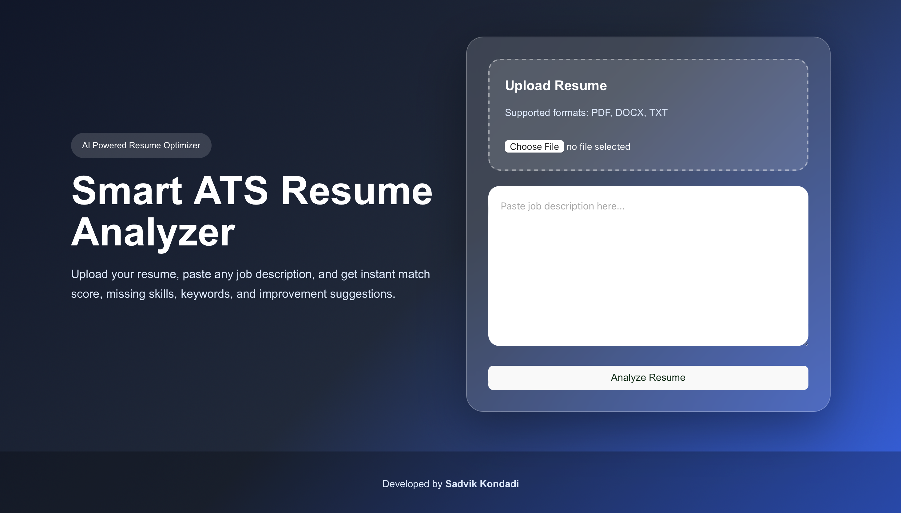
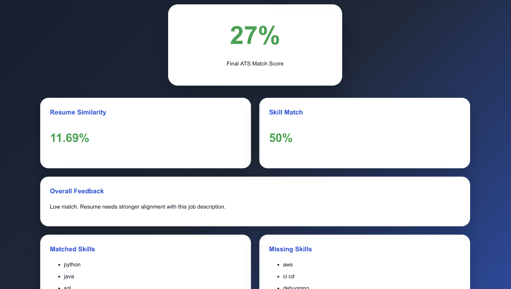
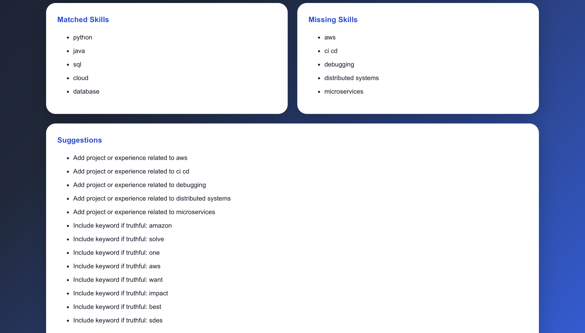

# AI Resume Analyzer

🚀 Live Website: https://ai-resume-analyzer-xi-topaz.vercel.app

📂 GitHub Repository: https://github.com/SadvikKondadi/ai-resume-analyzer

---

# Overview

AI Resume Analyzer is a full-stack AI-powered ATS (Applicant Tracking System) Resume Analyzer that compares uploaded resumes with job descriptions and generates intelligent resume analysis reports.

The platform uses NLP-based keyword extraction, TF-IDF similarity scoring, and skill-gap analysis to evaluate how well a resume matches a given job description.

Users can upload resumes in PDF, DOCX, or TXT format and instantly receive:

- ATS Match Score
- Resume Similarity Score
- Skill Match Analysis
- Missing Skills
- Missing Keywords
- Intelligent Resume Improvement Suggestions

---

# Features

✅ Upload Resume (PDF / DOCX / TXT)

✅ Paste Any Job Description

✅ NLP-Based Keyword Extraction

✅ TF-IDF Similarity Matching

✅ Skill Gap Analysis

✅ ATS Match Score Generation

✅ Intelligent Resume Suggestions

✅ Responsive Modern UI/UX

✅ Public Cloud Deployment

✅ Full Stack Architecture

---

# Tech Stack

## Frontend
- React.js
- Vite
- Axios
- CSS3

## Backend
- Flask
- Python
- REST APIs

## Machine Learning / NLP
- Scikit-learn
- TF-IDF Vectorization
- Cosine Similarity
- Keyword Extraction

## Resume Parsing
- PyPDF2
- python-docx

## Deployment
- Vercel (Frontend)
- Render (Backend)
- GitHub

---

# System Architecture

```text
User Upload Resume
        ↓
React Frontend (Vercel)
        ↓
Flask REST API (Render)
        ↓
Resume Parsing + NLP Processing
        ↓
TF-IDF Similarity + Skill Analysis
        ↓
ATS Score + Suggestions
        ↓
Results Displayed to User
```

---

# Installation & Local Setup

## Clone Repository

```bash
git clone https://github.com/SadvikKondadi/ai-resume-analyzer.git
cd ai-resume-analyzer
```

---

# Backend Setup

```bash
cd backend

python3 -m venv venv

source venv/bin/activate

pip install -r requirements.txt

python3 app.py
```

Backend runs on:

```text
http://127.0.0.1:5000
```

---

# Frontend Setup

```bash
npm install

npm run dev
```

Frontend runs on:

```text
http://localhost:5173
```

---

# Deployment

## Frontend Deployment
- Hosted on Vercel

## Backend Deployment
- Hosted on Render

---

# Project Highlights

- Developed scalable REST APIs using Flask
- Built responsive modern UI with React
- Implemented intelligent ATS scoring system
- Designed NLP-based resume-job matching workflow
- Added resume parsing support for multiple file formats
- Deployed production-ready cloud application

---

# Future Enhancements

- OpenAI API Integration
- AI Resume Rewrite Suggestions
- Authentication System
- Download ATS Report as PDF
- Resume History Tracking
- Advanced Semantic Search
- Drag & Drop Resume Upload
- Charts & Analytics Dashboard

---

# Screenshots

## Home Page



---

## ATS Analysis Result



---

## ATS Suggestions Result



---

# Author

## Sadvik Kondadi

- GitHub: https://github.com/SadvikKondadi
- LinkedIn: https://linkedin.com/in/sadvikkondadi

---

# License

This project is developed for educational and portfolio purposes.
